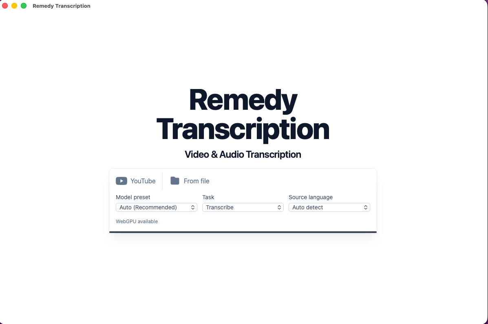

# Remedy Transcription



A standalone native desktop app for macOS and Windows that transcribes video and audio locally. Paste a YouTube URL or drop a file; it transcribes on your machine and exports SRT / TXT / JSON.

No server, no cloud, no Python runtime. The whole pipeline — yt-dlp download, ffmpeg extraction, ONNX Whisper inference — runs in-process inside the installed app.

Why "local-first": YouTube blocks data-center IPs, so a self-hosted (VPS) version of this kept hitting 403s. Running on the user's own machine sidesteps that entirely — and with ONNX Whisper running client-side via Hugging Face Transformers.js (WebGPU when available, WASM otherwise), there's no backend to host.

## Stack

- **Tauri 2** (Rust shell, single-binary installer)
- **React + Vite** (frontend, loaded into Tauri's webview)
- **@huggingface/transformers** (ONNX Whisper inference in a Web Worker)
- **yt-dlp / ffmpeg / ffprobe** (bundled as Tauri sidecar binaries)
- **rusqlite** (transcript cache, in OS app-data dir)

## Requirements

- macOS 11+ (Apple Silicon) or Windows 10+
- Internet on first run per Whisper model (models download from Hugging Face and cache in IndexedDB; subsequent runs work offline)
- Rust toolchain + Node 18+ to build from source

## Run from source

```bash
# 1. Fetch the downloaded sidecars (yt-dlp / ffmpeg / ffprobe) into
#    src-tauri/binaries/, plus the speaker-diarization models into models/.
./scripts/fetch-sidecars.sh

# 2. Compile the diarization sidecar into src-tauri/binaries/.
#    This one is ours, so it is compiled rather than downloaded.
./scripts/build-diarize-sidecar.sh

# 3. Install root and frontend JS deps from lockfiles.
npm ci
npm --prefix frontend ci

# 4. Run the dev build (Vite + Tauri, hot reload).
npm run dev
```

> **Step 2 is not optional, and it must come before any `cargo` command.**
> `diarize-sidecar` is registered as a Tauri `externalBin`, and `tauri-build`
> checks that every `externalBin` exists — so if it is missing, even a bare
> `cargo check` fails, with an opaque error that never mentions diarization:
>
> ```
> error: failed to run custom build command for `remedy-transcription`
> ```
>
> If you see that, you skipped step 2.
>
> **The models in step 1 are different: they are optional to BUILD, required to
> get speaker labels.** `tauri-build` validates configured `bundle.resources` the
> same way it validates `externalBin`, so listing the two `.onnx` files there
> would make `cargo check` fail on any checkout without them — including CI, and
> including a fresh clone. Instead the bundle takes the whole
> `models/diarization` **directory**, and `src-tauri/build.rs` creates it if it is
> absent. A build with no models therefore compiles, runs, and prints:
>
> ```
> warning: speaker diarization models are missing (...). This build compiles and
> runs, but diarization will report itself DEGRADED and produce no speaker labels.
> Fix with: ./scripts/fetch-sidecars.sh --models-only
> ```
>
> which is exactly what the app then does at runtime — `diarize_job` returns
> `Degraded` and the transcript is untouched. That degradation is a real, reachable
> path, not a theoretical one.

## Build an installer

```bash
./scripts/fetch-sidecars.sh
./scripts/build-diarize-sidecar.sh
npm ci
npm --prefix frontend ci
npm run build
```

Output: `src-tauri/target/release/bundle/` — `.dmg` on macOS, `.msi` / `.exe` on Windows. The installer is fully standalone; end users don't need Node, Rust, or Python on their machine.

## CI and build checks

GitHub Actions runs the checked build path on macOS:

```bash
npm ci
npm --prefix frontend ci
npm run frontend:build
npm --prefix frontend run lint
npm --prefix frontend test

# --skip-models: the diarization models are 34 MiB and only the #[ignore]d
# real-model tests touch them, so CI would be downloading them for nothing.
# This is safe ONLY because a missing models/ directory is a warning, not a
# build failure — see build.rs. It did not used to be.
./scripts/fetch-sidecars.sh --skip-models

# --debug: CI never bundles, so it only needs the binary to exist (for
# tauri-build) and to be spawnable (for the crash-isolation tests).
./scripts/build-diarize-sidecar.sh --debug

cargo check --workspace --manifest-path src-tauri/Cargo.toml
cargo test  --workspace --manifest-path src-tauri/Cargo.toml
```

Both sidecar steps run in CI, not only during release packaging, because Tauri validates the configured `externalBin` entries during `cargo check` and `cargo test` — a missing sidecar fails the build before a single test runs.

The models are the one bundled asset that `cargo check` tolerates being absent, and that is a deliberate, load-bearing exception rather than an accident: `build.rs` creates an empty `models/diarization` so `tauri-build` has a resource path to walk. If you ever move the models back to a per-file `bundle.resources` map (or a glob — an empty glob is a `GlobPathNotFound` error), CI breaks on a fresh clone and so does every `cargo check` without a 34 MiB download.

`--workspace` matters: `diarize-sidecar` is a separate workspace member, and the app's crash-isolation tests spawn the real binary. Without it, those tests have nothing to point at.

Release jobs must run `./scripts/fetch-sidecars.sh` **without** `--skip-models`: an installer built without them is a signed app with no speaker labels, and it will not tell you so at build time — only at runtime, as a degradation. Windows ffmpeg/ffprobe setup remains manual, as the script notes.

## Where your data lives

Everything stays on the local machine:

- Transcripts and job history → SQLite at `~/Library/Application Support/com.remedy.transcription/` (macOS) or `%APPDATA%\com.remedy.transcription\` (Windows)
- Cached YouTube audio → `audio/` next to the DB (7-day TTL)
- Whisper models → the webview's IndexedDB

Nothing is uploaded. The only outbound traffic is to YouTube (via yt-dlp) and to Hugging Face (model downloads, first run only).

## Accessibility, Education, and Fair Use

Remedy Transcription is intended to support lawful accessibility workflows, including creating transcripts and captions for educational course materials, ADA/Section 504 accommodation, and equal-access needs.

In the United States, fair use may permit certain unlicensed uses for teaching, scholarship, research, accessibility, and other public-interest purposes. Fair use is a fact-specific legal analysis, and an educational or ADA-related purpose does not automatically authorize downloading, copying, redistributing, or publishing YouTube content.

Users and institutions are responsible for determining whether each use is authorized by ownership, license, permission, Creative Commons/public-domain status, fair use, ADA/Section 504 obligations, or another legal basis. Prefer content you own, are licensed to use, or are specifically authorized to download and transcribe. Do not redistribute downloaded media, generated transcripts, or captions unless you have the right to do so.

## Architecture

See [CLAUDE.md](./CLAUDE.md) for the full breakdown.

```
React webview ←─Tauri IPC─→ Rust core ──spawn──> yt-dlp + ffmpeg
      │
      └─ Web Worker → Transformers.js → ONNX Whisper
```

## What's where

| Path | What |
|------|------|
| `frontend/src/` | React app, services, worker, caption formatter, SRT generator |
| `src-tauri/src/` | Rust commands, SQLite store, sidecar wrappers, event emitter |
| `src-tauri/diarize-sidecar/` | Speaker diarization (sherpa-onnx). A separate binary on purpose — see below |
| `src-tauri/binaries/` | Bundled `yt-dlp` / `ffmpeg` / `ffprobe` / `diarize-sidecar` per target triple |
| `models/diarization/` | Diarization ONNX models — fetched by script, never committed |
| `src-tauri/icons/` | Generated app icons |
| `src-tauri/tauri.conf.json` | Bundle config, sidecar registration, permissions |

Diarization runs in its own process because ONNX Runtime does not report a corrupt or truncated model as an error — it throws a C++ exception that nothing catches, and the C++ runtime aborts the process (`SIGABRT`). In-process, one bad byte in a model file would take transcription down with it. Out of process, it is a dead child and an error, and the transcript simply arrives without speaker labels.

### Shipped-size cost of speaker diarization

Because sherpa-onnx / ONNX Runtime is linked only into `diarize-sidecar`, not
into the main app, the main app binary carries none of the cost. Measured on a
release build, macOS arm64, 2026-07-14 (`lto = true`, `opt-level = "s"`,
`strip = true`):

| Artifact | Bytes | |
|---|---|---|
| `remedy-transcription` (main app) | 6,920,256 | unchanged by diarization — `strings … \| grep -ci onnxruntime` = 0, `cargo tree -p remedy-transcription \| grep sherpa` = nothing |
| `diarize-sidecar` | 16,333,600 | ~15.6 MiB — links ONNX Runtime (`grep -ci onnxruntime` = 2004) |
| `sherpa-onnx-pyannote-segmentation-3-0/model.onnx` | 5,992,913 | ~5.7 MiB, bundled as a Tauri resource |
| `wespeaker_en_voxceleb_CAM++.onnx` | 29,292,684 | ~27.9 MiB, bundled as a Tauri resource |
| **Total added to the shipped installer** | **51,619,197** | **≈ +49 MiB (+52 MB)** — sidecar binary + both models; not committed to the repo, but present in every built `.app`/`.msi` |

Both models are bundled into the app as Tauri `resources` (a whole-directory
resource, not a hand-picked file list — see `src-tauri/build.rs`), so they ship
inside the installer even though `models/diarization/` is gitignored and never
committed. `./scripts/fetch-sidecars.sh --models-only` re-fetches them from
sherpa-onnx's own GitHub releases.

### Accuracy — smoke-tested, not benchmarked

sherpa-onnx's ONNX port of pyannote/WeSpeaker is a different implementation
from the upstream Python pipeline, and upstream issue #1708 reports it can
diverge from it; nothing here quantifies that gap into a DER (diarization
error rate) number, and the following is **not** a DER benchmark.

What has been checked: the sidecar correctly finds 2 speakers with turn
boundaries within ~50 ms of ground truth on 3 of 4 turns on the committed
`two_speakers.wav` fixture (macOS `say`, two distinct voices), and separately
recovers a 2-speaker count exactly on a denser 8-turn fixture when told
`num_speakers = 2` (see `src-tauri/src/diarize.rs`'s `#[ignore]`d tests, run
with `cargo test --workspace -- --ignored`). A follow-up spot check with two
different `say` voices and different sentence content was inconsistent: on a
32 s, 4-turn "interview" clip, both auto-detect (5 spurious speakers) and
`num_speakers = 2` (which merged three real turns into one, then hallucinated
alternation in the last 7 s) missed most of the true turn boundaries; on a
15 s, 6-turn rapid exchange, auto-detect partially tracked alternation but
reused inconsistent ids for the same speaker, and `num_speakers = 2` collapsed
4 of 5 boundaries. In short: accuracy is real but inconsistent, and depends
on voice pair, turn length, and content — consistent with the upstream issue,
not a confirmation of any specific error rate.

`say`-generated speech is also cleaner than real recordings (no overlap, no
background noise, uniform prosody), so a real accuracy claim would need
several minutes of genuinely recorded, multi-speaker audio with hand-labeled
ground truth (ideally scored with a real DER tool, e.g. `pyannote.metrics`)
across a representative sample — none of which exists in this repo. Until
that exists, the UI should keep treating speaker labels as a best-effort aid,
not an authoritative transcript feature.

## License

MIT. See `LICENSE`.
