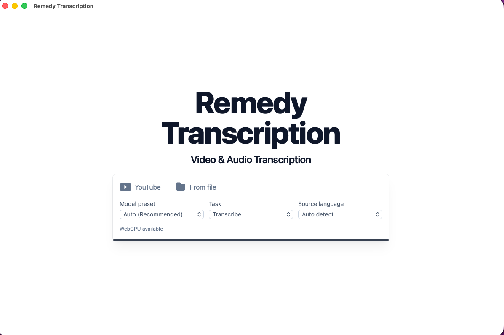

# Remedy Transcription



A standalone native desktop app for macOS and Windows that transcribes video and audio locally. Paste a YouTube URL or drop a file; it transcribes on your machine and exports SRT / TXT / JSON.

No server, no Python runtime, and no cloud by default. The whole pipeline — yt-dlp download, ffmpeg extraction, ONNX Whisper inference — runs in-process inside the installed app. An opt-in Google Gemini engine is also available; see [Transcription engines](#transcription-engines) below for the trade it makes.

Why "local-first": YouTube blocks data-center IPs, so a self-hosted (VPS) version of this kept hitting 403s. Running on the user's own machine sidesteps that entirely — and with ONNX Whisper running client-side via Hugging Face Transformers.js (WebGPU when available, WASM otherwise), there's no backend to host.

## Stack

- **Tauri 2** (Rust shell, single-binary installer)
- **React + Vite** (frontend, loaded into Tauri's webview)
- **@huggingface/transformers** (ONNX Whisper inference in a Web Worker)
- **yt-dlp / ffmpeg / ffprobe** (bundled as Tauri sidecar binaries)
- **rusqlite** (transcript cache, in OS app-data dir)

## Requirements

- macOS 11+ (Apple Silicon) or Windows 10+
- Internet on first run per Whisper model (models download from Hugging Face and cache in IndexedDB; subsequent runs work offline)
- Rust toolchain + Node 18+ to build from source

## Run from source

```bash
# 1. Fetch the yt-dlp / ffmpeg / ffprobe sidecars into src-tauri/binaries/.
./scripts/fetch-sidecars.sh

# 2. Install root and frontend JS deps from lockfiles.
npm ci
npm --prefix frontend ci

# 3. Run the dev build (Vite + Tauri, hot reload).
npm run dev
```

## Build an installer

```bash
./scripts/fetch-sidecars.sh
npm ci
npm --prefix frontend ci
npm run build
```

Output: `src-tauri/target/release/bundle/` — `.dmg` on macOS, `.msi` / `.exe` on Windows. The installer is fully standalone; end users don't need Node, Rust, or Python on their machine.

**This is not the command that produces a shippable macOS build.** `npm run build` signs the app but does not notarize it, and an unnotarized `.dmg` is refused by Gatekeeper with *"Apple could not verify this app is free of malware."* The bundle looks finished and is not. To cut a release, see below.

## Cutting a release

Use `npm run release` (`scripts/build-release.sh`), never `npm run build`. It builds for `aarch64-apple-darwin`, signs with your Developer ID, submits to Apple, waits for the result, staples the ticket, and then verifies Gatekeeper accepts both the `.app` and the `.dmg`.

It needs three values, in a gitignored `.env.local` at the repo root:

```bash
APPLE_ID=you@example.com          # your Apple ID email
APPLE_PASSWORD=xxxx-xxxx-xxxx-xxxx # app-specific password, NOT your account password
APPLE_TEAM_ID=7XU3QW326W           # from `security find-identity -v -p codesigning`
```

Generate the app-specific password at [appleid.apple.com](https://appleid.apple.com) → Sign-In and Security → App-Specific Passwords. `.env.local` is gitignored, so it does not survive a fresh clone — expect to recreate it on a new machine.

The release is notarized only if the script prints:

```
source=Notarized Developer ID
```

`Unnotarized Developer ID`, or `rejected`, means do not ship it.

Then tag and publish:

```bash
git tag -a v1.3.0 -m "Remedy Transcription 1.3.0"
git push origin v1.3.0
```

Pushing a `v*` tag triggers `.github/workflows/release.yml`, which runs the same script on CI and refuses to publish anything `spctl` does not report as notarized. That workflow needs six repository secrets — the three above plus `APPLE_SIGNING_IDENTITY` (the full `Developer ID Application: ...` string), `APPLE_CERTIFICATE` (the Developer ID `.p12` base64-encoded: `base64 -i cert.p12 | pbcopy`), and `APPLE_CERTIFICATE_PASSWORD`. Until those are set the workflow fails immediately with the list of what is missing, rather than shipping an unsigned build.

## CI and build checks

GitHub Actions runs the checked build path on macOS:

```bash
npm ci
npm --prefix frontend ci
npm run frontend:build
npm --prefix frontend run lint
npm --prefix frontend test

./scripts/fetch-sidecars.sh

cargo check --manifest-path src-tauri/Cargo.toml
cargo test  --manifest-path src-tauri/Cargo.toml
```

## Transcription engines

Two engines, chosen per job:

- **On-device (default).** ONNX Whisper via Transformers.js, as described above. Private: nothing about the audio or the transcript leaves the machine.
- **Google Gemini** (`gemini-3.5-transcribe`). Opt-in, and the trade should be stated plainly, not softened: your audio file is uploaded to Google, transcribed, and the copy Google holds is deleted as soon as the transcript comes back. That is why it is opt-in rather than the default. It costs roughly $0.005 per minute of audio.

Gemini is authenticated with a Google AI Studio API key, entered once. The key is stored in the operating system's keychain (Keychain on macOS, Credential Manager on Windows) — never in this app's own database, and there is no command that reads it back out to the app's UI. Pasting a new key replaces the old one; "Change" means replace, not edit.

Speaker labels are Gemini-only, and only for audio **under 28 minutes**. Gemini's API caps a single request at 30 minutes once diarization is requested, so a longer file is split into multiple requests automatically. The model assigns speaker ids (`spk_1`, `spk_2`, …) fresh per request, with no way to tell that `spk_1` in part 2 is the same person as `spk_1` in part 1 — so rather than guess, split files get a transcript with no speaker labels at all.

Local speaker diarization (sherpa-onnx) was removed in 1.2.0. It shipped in 1.1.0 disabled behind a feature flag because its speaker embeddings mislabelled a single narrator as four different speakers. Gemini's diarization cleared that bar, so the local engine was deleted rather than fixed. If you were relying on the old local diarization, that removal — not a regression — is why it's gone.

Deleting that diarizer did not delete the labels it had already written: `speaker` is stored on every persisted segment, so a transcript it touched kept rendering its speakers long after the code that produced them was gone. Those labels are now dropped when the transcript is read back — a stored transcript is trusted with speakers only if a cloud engine's pinned model produced it. Nothing else about the transcript changes, and Gemini's labels are unaffected.

## Where your data lives

By default, everything stays on the local machine:

- Transcripts and job history → SQLite at `~/Library/Application Support/com.remedy.transcription/` (macOS) or `%APPDATA%\com.remedy.transcription\` (Windows)
- Cached YouTube audio → `audio/` next to the DB (7-day TTL)
- Whisper models → the webview's IndexedDB

The only outbound traffic is to YouTube (via yt-dlp) and to Hugging Face (model downloads, first run only) — unless you opt into the Gemini engine, in which case the audio for that job is uploaded to Google as described above. The Gemini API key itself never touches the local database; it lives only in the OS keychain.

## Accessibility, Education, and Fair Use

Remedy Transcription is intended to support lawful accessibility workflows, including creating transcripts and captions for educational course materials, ADA/Section 504 accommodation, and equal-access needs.

In the United States, fair use may permit certain unlicensed uses for teaching, scholarship, research, accessibility, and other public-interest purposes. Fair use is a fact-specific legal analysis, and an educational or ADA-related purpose does not automatically authorize downloading, copying, redistributing, or publishing YouTube content.

Users and institutions are responsible for determining whether each use is authorized by ownership, license, permission, Creative Commons/public-domain status, fair use, ADA/Section 504 obligations, or another legal basis. Prefer content you own, are licensed to use, or are specifically authorized to download and transcribe. Do not redistribute downloaded media, generated transcripts, or captions unless you have the right to do so.

## Architecture

See [CLAUDE.md](./CLAUDE.md) for the full breakdown.

```
React webview ←─Tauri IPC─→ Rust core ──spawn──> yt-dlp + ffmpeg
      │
      └─ Web Worker → Transformers.js → ONNX Whisper
```

## What's where

| Path | What |
|------|------|
| `frontend/src/` | React app, services, worker, caption formatter, SRT generator |
| `src-tauri/src/` | Rust commands, SQLite store, sidecar wrappers, event emitter |
| `src-tauri/binaries/` | Bundled `yt-dlp` / `ffmpeg` / `ffprobe` per target triple |
| `src-tauri/icons/` | Generated app icons |
| `src-tauri/tauri.conf.json` | Bundle config, sidecar registration, permissions |

## License

MIT. See `LICENSE`.
